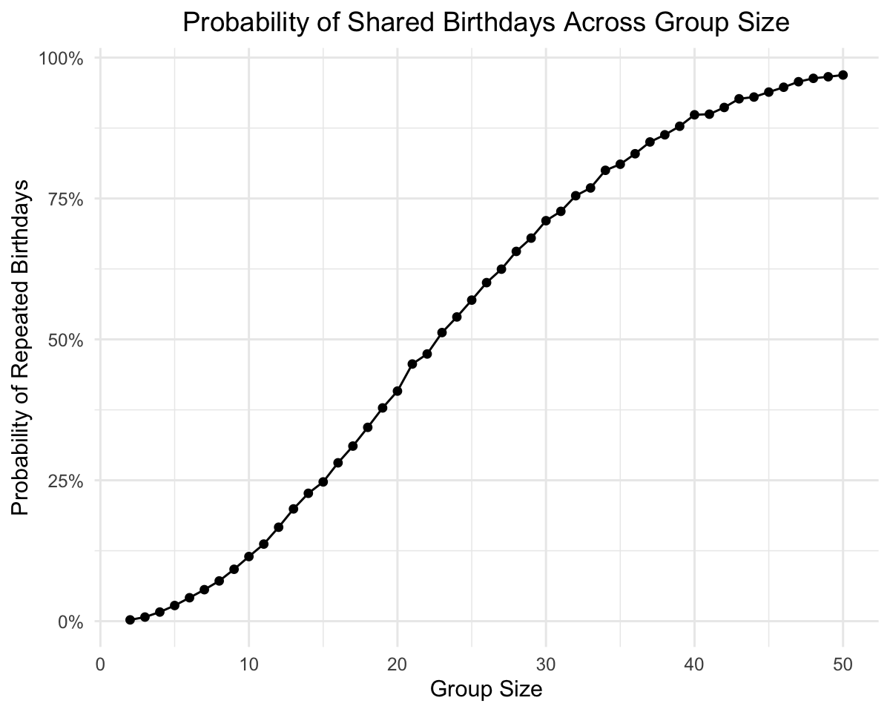
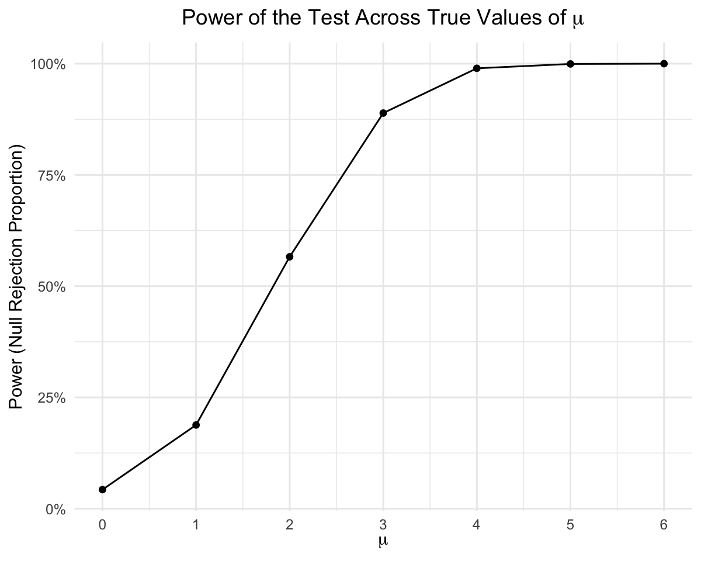
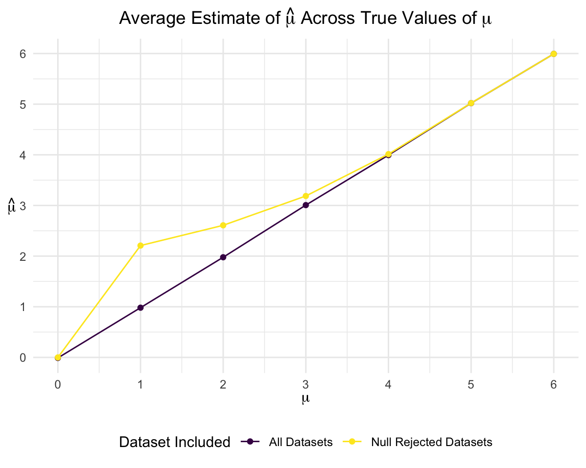
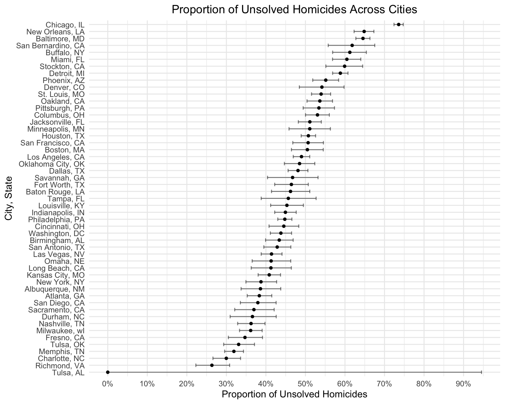

p8105_hw5_xh2601
================

``` r
# load the tidyverse library
library(tidyverse)
```

The general format for plots making

``` r
knitr::opts_chunk$set(
  fig.width = 6,
  fig.asp = .8,
  out.width = "90%",
  dpi = 200
)

theme_set(
  theme_minimal() + 
    theme(legend.position = "bottom",
          plot.title = element_text(hjust = 0.5))
)

options(
  ggplot2.continuous.colour = "viridis",
  ggplot2.continuous.fill = "viridis"
)

scale_colour_discrete = scale_colour_viridis_d
scale_fill_discrete = scale_fill_viridis_d
```

## Problem 1

Write a function that randomly draws “birthdays” for each person; checks
whether there are duplicate birthdays in the group; and returns TRUE or
FALSE based on the result.

``` r
# the function takes group size 'n_room' as a parameter
bday_sim = function(n_room) {
  # randomly draw n_room samples from the range 1-365, with replacement
  birthdays = sample(1:365, n_room, replace = TRUE)
  # if the length of unique birthdays is less than the group size, then there are repeated birthdays
  repeated_bday = length(unique(birthdays)) < n_room
  # return TRUE or FALSE
  repeated_bday
}
```

Run this function 10000 times for each group size between 2 and 50. For
each group size, compute the probability that at least two people in the
group will share a birthday by averaging across the 10000 simulation
runs. Make a plot showing the probability as a function of group size,
and comment on your results.

``` r
# use expand_grid() to create a dataframe for group size ranged 2-50, each has 10000 times iteration
# use map() to call bday_sim() fuction with each group size for 10000 times
# use mutate() to store the result from map()
# group by group size
# create a summarize dataframe to show the mean probability of having repeated birthdays for each group size
bday_sim_results = 
  expand_grid(
    group_sz = 2:50,
    iter = 1:10000
  ) |> 
  mutate(
    result = map_lgl(group_sz, bday_sim)
  ) |> 
  group_by(group_sz) |> 
  summarize(
    prob_repeat = mean(result)
  )

# make a dot point, with x-axis being group size, y-axis being the probability of having repeated birthday
bday_sim_results |> 
  ggplot(aes(x = group_sz, y = prob_repeat)) +
  geom_point() +
  geom_line() +
  labs(
    title = "Probability of Shared Birthdays Across Group Size", 
    x = "Group Size", 
    y = "Probability of Repeated Birthdays") +
  scale_y_continuous(
    labels = scales::label_percent(scale = 100))
```



Based on the plot, in group size between 2 to 50, the probability of at
least two people sharing a birthday approximately follows a S-shaped
curve. The probability is approaching 0% when the group size is 2; it is
above 50% when group size is larger than or equals to 23 people; and it
approaches 100% when the group size gets larger. The probability of at
least two people sharing a birthday among 50 people is very high.

## Problem 2

Generate a dataset from the model x~Normal\[µ,σ\], with fixed n = 30, σ
= 5.

``` r
# create a function to generate a dataset of a normal model with fixed n and sigma
norm_fixed = function(mu, sigma = 5, n = 30) {
  x = rnorm(n = n, mean = mu, sd = sigma)
  x
}
```

Conduct one-sample t-test of H: µ = 0 using α = 0.05.

``` r
# create a function to generate the t test output with H_null: mu = 0 using alpha = 0.05
t_test_fixed = function(dataset, h0_mu = 0, alpha = 0.05) {
  t_result = 
    t.test(x = dataset, mu = h0_mu, conf.level = 1 - alpha) |> 
    broom::tidy()
  t_result
}
```

1.  Set µ = 0. Generate 5000 datasets from the model. For each dataset,
    save µ_hat and the p-value arising from a test.

``` r
# use expand_grid() to create a dataframe for mu = 0 with 5000 times iteration
# use map() to call norm_fixed() fuction with mu = 0
# use map() to call t_test_fixed() fuction with dataset = dataset_vec
# use mutate() to store the result from map()
# unnest the t test result from t_test_fixed() fuction
# keep mu, iteration number, mu_hat, and p_value from the test
datasets_sim_df_0 = 
  expand_grid(
    mu = 0,
    iter = 1:5000
  ) |> 
  mutate(
    dataset_vec = map(mu, norm_fixed),
    t_result = map(dataset_vec, t_test_fixed)
  ) |> 
  unnest(t_result) |> 
  select(mu, iter, mu_hat = estimate, p_value = p.value)
```

2.  Repeat the above for µ = {1,2,3,4,5,6}.

``` r
# use expand_grid() to create a dataframe for mu = {0,1,2,3,4,5,6} with 5000 times iteration
# repeat the above steps
datasets_sim_df = 
  expand_grid(
    mu = 0:6,
    iter = 1:5000
  ) |> 
  mutate(
    dataset_vec = map(mu, norm_fixed),
    t_result = map(dataset_vec, t_test_fixed)
  ) |> 
  unnest(t_result) |> 
  select(mu, iter, mu_hat = estimate, p_value = p.value)
```

3.  Make a plot showing the proportion of times the null was rejected
    (the power of the test) on the y axis and the true value of µ on the
    x axis. Describe the association between effect size and power.

``` r
# define the variable 'reject': reject null if p value < alpha (=0.05)
# group by true value of mu
# get the proportion of rejecting null
# make a dot plot with line, with x-axis being true value of mu, y-axis being the proportion of times the null was rejected
datasets_sim_df |> 
  mutate(
    reject = p_value < 0.05
  ) |> 
  group_by(mu) |> 
  summarize(
    reject_prop = mean(reject)
  ) |> 
  ggplot(aes(x = mu, y = reject_prop)) +
  geom_point() +
  geom_line() +
  labs(
    title = expression("Power of the Test Across True Values of " * mu),
    x = expression(mu),
    y = "Power (Null Rejection Proportion)") +
  scale_x_continuous(
    breaks = seq(0, 6, 1)) +
  scale_y_continuous(
    labels = scales::label_percent(scale = 100))
```



In this simulation, the effect size (e.g., Cohen’s d: d = (µ-µ0)/sigma)
only depends on the true value of µ. For µ = 0, 1, 2, 3, 4, 5, 6, their
effect sizes are 0, 0.2, 0.4, 0.6, 0.8, 1.0, 1.2 respectively. As effect
size increases, the power (proportion of times the null was rejected)
increases, and their association approximately follows a S-shaped curve.
When effect size is 0, the power is very low (below 10%); when effect
size is 0.4, power is around 50%; and when effect size is larger than 1,
power is approaching 100%.

4.  Make a plot showing the average estimate of µ_hat on the y axis and
    the true value of µ on the x axis. Make a second plot (or overlay on
    the first) the average estimate of µ_hat only in samples for which
    the null was rejected on the y axis and the true value of µ on the x
    axis.

``` r
# define the variable 'reject': reject null if p value < alpha (=0.05)
# group by true value of mu
# get the mean of mu_hat for all datasets and for datasets that reject null
# make two dot plots with line, with x-axis being true value of mu, y-axis being mu_hat
datasets_sim_df |> 
  mutate(
    reject = p_value < 0.05
  ) |>
  group_by(mu) |> 
  summarize(
    mu_hat_mean = mean(mu_hat),
    mu_hat_rejected_mean = mean(mu_hat[reject])
  ) |> 
  ggplot(aes(x = mu)) +
  geom_point(aes(y = mu_hat_mean, color = "All Datasets")) +
  geom_line(aes(y = mu_hat_mean, color = "All Datasets")) +
  geom_point(aes(y = mu_hat_rejected_mean, color = "Null Rejected Datasets")) +
  geom_line(aes(y = mu_hat_rejected_mean, color = "Null Rejected Datasets")) +
  labs(
    title = expression("Average Estimate of " * hat(mu) * " Across True Values of " * mu),
    x = expression(mu),
    y = expression(hat(mu)),
    color = "Dataset Included") +
  scale_x_continuous(
    breaks = seq(0, 6, 1)) +
  scale_y_continuous(
    breaks = seq(0, 6, 1)) +
  theme(
    axis.title.y = element_text(angle = 0, vjust = 0.5)
  )
```



5.  Is the sample average of µ_hat across tests for which the null is
    rejected approximately equal to the true value of µ? Why or why not?

The sample averages of µ_hat across tests for which the null is rejected
are larger than the true value of µ when µ is small, but approximately
equal to the true value of µ when µ is large. This is because across
tests for which the null is rejected, their µ_hat would be significantly
higher than 0 to be rejected, and this group of tests on average has a
higher µ_hat value campared to the true value of µ. However, when true
value of µ becomes larger, the effect size increases and so does the
power, which means that most of the datasets reject null at a higher µ.
Therefore, the sample averages of µ_hat across tests for which the null
is rejected approximately equal to the sample averages of µ_hat across
all tests for a given µ value, which approximates the true value of µ.

## Problem 3

1.  Describe the raw data.

``` r
# import the dataset
homicide_df = read_csv("data/homicide-data.csv") |> 
  janitor::clean_names()
```

    ## Rows: 52179 Columns: 12
    ## ── Column specification ────────────────────────────────────────────────────────
    ## Delimiter: ","
    ## chr (9): uid, victim_last, victim_first, victim_race, victim_age, victim_sex...
    ## dbl (3): reported_date, lat, lon
    ## 
    ## ℹ Use `spec()` to retrieve the full column specification for this data.
    ## ℹ Specify the column types or set `show_col_types = FALSE` to quiet this message.

This dataset contains information on 52,179 homicides that occurred in
51 American cities. For each homicide case, the dataset may include the
following details: case ID, date reported, victim information (first
name, last name, race, age, and sex), location (city, state, latitude,
and longitude), and the case disposition.

2.  Create a city_state variable (e.g. “Baltimore, MD”) and then
    summarize within cities to obtain the total number of homicides and
    the number of unsolved homicides (those for which the disposition is
    “Closed without arrest” or “Open/No arrest”).

``` r
# use mutate() to create the city_state variable
# use mutate() to create a variable to indicate whether the case is unsolved
# group by city_state
# summarize the total cases and unsolved cases
homicide_sum_df = homicide_df |> 
  mutate(
    city_state = str_c(city, ", ", state),
    unsolved = (disposition %in% c("Closed without arrest", "Open/No arrest"))
  ) |> 
  group_by(city_state) |> 
  summarize(
    n_total = n(),
    n_unsolved = sum(unsolved, na.rm = TRUE)
  )
```

3.  For the city of Baltimore, MD, use the prop.test function to
    estimate the proportion of homicides that are unsolved; save the
    output of prop.test as an R object, apply the broom::tidy to this
    object and pull the estimated proportion and confidence intervals
    from the resulting tidy dataframe.

``` r
# for the city of Baltimore, MD
baltimore = homicide_sum_df |> 
  filter(city_state == "Baltimore, MD")

# save the output of prop.test as an R object
proportion_baltimore = 
  prop.test(
    x = baltimore$n_unsolved,
    n = baltimore$n_total)

# pull the estimated proportion and confidence intervals
proportion_baltimore |> 
  broom::tidy() |> pull(estimate)
```

    ##         p 
    ## 0.6455607

``` r
proportion_baltimore |> 
  broom::tidy() |> pull(conf.low)
```

    ## [1] 0.6275625

``` r
proportion_baltimore |> 
  broom::tidy() |> pull(conf.high)
```

    ## [1] 0.6631599

4.  Now run prop.test for each of the cities in your dataset, and
    extract both the proportion of unsolved homicides and the confidence
    interval for each.

``` r
# create a function to get the proportion and confidence interval, takes the number of unsolved homicides and total homicides
prop_test_homicide = function(x, n) {
  proportion = 
    prop.test(
      x = x,
      n = n) |> 
    broom::tidy()
  
  # return the proportion and confidence interval
  tibble(
    unsolved_prop = proportion |> pull(estimate),
    conf_low = proportion |> pull(conf.low),
    conf_high = proportion |> pull(conf.high)
  )
}
```

``` r
# update the dataframe with estimated proportions and CIs for each city using map2
# use map2() to apply the prop_test_homicide() function with x = n_unsolved, n = n_total
# use mutate() to add a column to store the output from prop_test_homicide()
# use unnest() to show estimates and CIs
homicide_sum_df = homicide_sum_df |>
  mutate(
    prop_test_result = map2(n_unsolved, n_total, prop_test_homicide)
  ) |> 
  unnest(prop_test_result)
```

    ## Warning: There was 1 warning in `mutate()`.
    ## ℹ In argument: `prop_test_result = map2(n_unsolved, n_total,
    ##   prop_test_homicide)`.
    ## Caused by warning in `prop.test()`:
    ## ! Chi-squared approximation may be incorrect

5.  Create a plot that shows the estimates and CIs for each city

``` r
homicide_sum_df |> 
  mutate(
    city_state = fct_reorder(city_state, unsolved_prop)
  ) |> 
  ggplot(aes(y = city_state, x = unsolved_prop)) +
  geom_point(size = 1.2) +
  geom_errorbarh(aes(xmin = conf_low, xmax = conf_high), height = 0.5, alpha = 0.5) +
  labs(
    title = "Proportion of Unsolved Homicides Across Cities",
    x = "Proportion of Unsolved Homicides",
    y = "City, State") +
  scale_x_continuous(
    labels = scales::label_percent(accuracy = 1),
    breaks = seq(0, 1, 0.1),
  ) 
```


